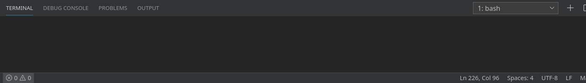
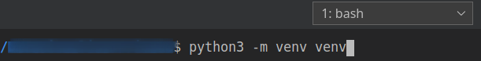

# Simple-Time-Optimization-Task

This project finds the most optimal time. So, this repo can be a template for some tasks which try to find the best solution. This is one of my projects from one of my university courses.

An original technical task is attached and displayed down below.

# Results

All tasks are fully completed within the deadline (Dec of 2019). I'm sorry that I didn't add this README file earlier.

The answers are shown as:

```
The optimal list: 
[1.0, 1.0, 1.0, 0.5, 1.5, 4.0]
All valid lists(satisfying the deadline): 
[[1.0, 1.0, 1.0, 0.5, 1.5, 4.0]]
```


This app has a viewer based on PyQt5. This viewer is able to:

- to change, update and show input data

- to show the best possible solution

- to import/export data as json files


# What are the parts of this repo?

There are 2 separate files:

1. 'main.py', contains a gui with all needed classes
2. 'main_without_gui.py', contains classes to interact with the data without a GUI

### Cross-platform interface

An interface is written both in Russian and in English, so it is possible to switch language dictionaries in the source code


It is possible to change the look of the interface


# Technical Task (The original version is written in Russian)

An employee of the statistical office was instructed to prepare N documents.
Documents with numbers K and L must be prepared by a certain date V.
We know the time Tij (I, j = 1,2, ..., N) required to prepare the I-th document in
j-th queue. Start time of work on the documents is U.
Determine the preparation order, in which all documents will be prepared on time and in the shortest possible time.


Develop an ability to set arbitrary input data both manually and
automatically (for example, from a file). You can use the proposed
initial data to check the work of an app.


***Design a graphical user interface.***


# Техническое задание

Работнику статистического отдела поручено подготовить N справок. Справки
с номерами K и L должны быть подготовлены к определенному сроку V.
Известно время Tij (I,j=1,2,...,N), необходимое на подготовку I-ой справки в
j-ю очередь. Время начала работы над справками U. Определить порядок
подготовки справок, при котором все справки будут подготовлены в срок и за
наименьшее время.

Разработать возможность задавать произвольные исходные данные как в ручную, так и
автоматически (например, из файла). Для проверки можно использовать предложенные
исходные данные.


***Разработать графический интерфейс пользователя.***


# Initial data (Исходные данные)

N = 5; U= 0; V = 4; K = 2; L = 4; T = 

 | 2 2 1 1 1 |
 
 | 1 1 0.5 0.5 0.5 |
 
 | 2 2 4 4 4 |
 
 | 1 1 1 0.5 o.5 |
 
 | 1 2 2 2 2 |
 
(And the answer is: | 1 1 0.5 0.5 0.5 | )


# How to run the code

The following steps assume using VS Code. 

Open a terminal:



Create a virtual environment called 'venv':



```
python3 -m venv venv
```

Select 'venv' for the workspace folder by clicking 'Yes':


Activate Your 'venv' or simply open a new terminal in VS Code by clicking "Plus" symbol (near 'bash'), it will auto-activate it:


Install the requirements:


```
pip install -r requirements.txt
```

Run the code:

```
python3 main.py
```


## Rate this project! :star:
### If You liked this repo, give it a star. Thanks!
